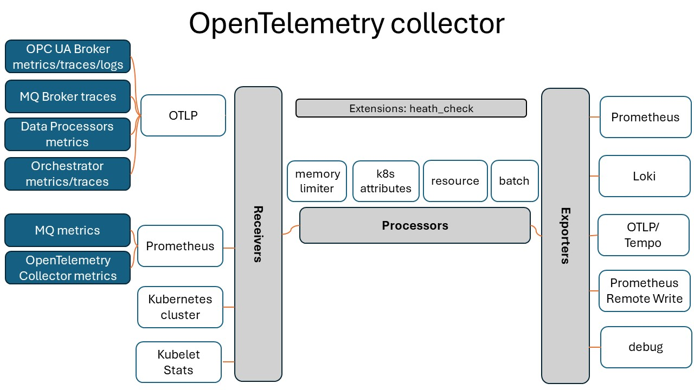

# Observability setup

- [Observability setup](#observability-setup)
  - [Context](#context)
  - [Local egde observability stack](#local-egde-observability-stack)
  - [OpenTelemetry collector configuration](#opentelemetry-collector-configuration)
  - [Grafana dashboards updates](#grafana-dashboards-updates)
  - [Considerations](#considerations)
  - [Troubleshooting](#troubleshooting)

## Context

Current [observability documentation](https://learn.microsoft.com/azure/iot-operations/configure-observability-monitoring/howto-configure-observability) for Azure IoT Operations Preview explains how to deploy the [OpenTelemetry Collector](https://opentelemetry.io/docs/collector/) which is responsible for collecting metrics, traces, and logs from various components.

In this repository we demonstrate:

* how to setup and configure the OpenTelemetry Collector through Flux
* how to export observability telemetry data (including metrics, logs and traces) to an edge observability stack running locally.

## Local edge observability stack

The local edge observability stack is composed of the following components:

* Grafana for interactive visualizations and analytics,
* Tempo for tracing,
* Loki for logging,
* Prometheus for metrics.

These components are deployed to the cluster using a GitOps approach through Flux. The `app` folder contains [edge-observability](./apps/edge-observability/) directory where all components are configured. This is achieved by specifying a Helm repository and then configuring a Helm release for each component with the minimal required setup.

The Prometheus Helm chart deploys the Prometheus server, the Grafana Loki Helm chart deploys Loki, and the Grafana Tempo Helm chart deploys Tempo. The Grafana Helm chart configures data sources to visualize data from Prometheus, Loki, and Tempo. It also deploys a set of dashboards, which include:

- Custom dashboards located in the [grafana-dashboards](/apps/edge-observability/1.0/grafana-dashboards/) folder. These were created based on the provided [sample dashboards](https://github.com/Azure/azure-iot-operations/tree/main/samples/grafana-dashboards).
- Dashboards imported from grafana.com, such as the [OpenTelemetry Collector](https://grafana.com/dashboards/15983) and [Otel - kubeletstats](https://grafana.com/dashboards/18681) dashboards.

All pods are deployed to the `edge-observability` namespace, so you can view them by running:

   ```bash
   kubectl get pods -n edge-observability
   ```

## OpenTelemetry collector configuration

The OpenTelemetry Collector Helm chart is deployed through GitOps Flux configuration. This configuration is setup as a dependency to the previously installed local observability tools described above. The OpenTelemetry collector is deployed into the namespace `opentelemetry`. The collector is exposed through the service endpoint `otel-collector.opentelemetry.svc.cluster.local`.

Installation of Azure IoT Operations is triggered after this release so that its components can reference the OpenTelemetry Collector endpoint as a destination for metrics. This is done by passing `--ops-config` arguments to the `az iot ops create` command.

In the default configuration, the collected metrics are exposed by the collector on port 8889. To view them, run the command `kubectl port-forward svc/aio-otel-collector 8889:8889 -n azure-iot-operations` and then access http://localhost:8889/metrics. Additionally, logs and traces are logged to the console output of the collector.

The OpenTelemetry Collector is highly configurable, allowing for the definition of multiple receivers, processors, and exporters.

The configuration we use for this sample include:

* exporters
  * [prometheusremotewrite](https://github.com/open-telemetry/opentelemetry-collector-contrib/blob/main/exporter/prometheusremotewriteexporter/README.md) that sends OpenTelemetry metrics to a locally running Prometheus server.
  * [loki](https://github.com/open-telemetry/opentelemetry-collector-contrib/tree/main/exporter/lokiexporter#readme) that exports logs to a locally running Loki server.
  * [otlp](https://github.com/open-telemetry/opentelemetry-collector/tree/main/exporter/otlpexporter) that exports traces to a locally running Tempo server.
  * [debug](https://github.com/open-telemetry/opentelemetry-collector/tree/main/exporter/debugexporter) that exports data to the console.
* processors
  * [resourceprocessor](https://github.com/open-telemetry/opentelemetry-collector-contrib/tree/main/processor/resourceprocessor) that adds resource attribute `deployment.environment` to all telemetry data.
  * [k8sattributes](https://github.com/open-telemetry/opentelemetry-collector-contrib/blob/main/processor/k8sattributesprocessor/README.md) that discovers k8s resources, extracts metadata from them and adds the extracted metadata to the relevant spans, metrics and logs as resource attributes.
* receivers
  * [k8s_cluster](https://github.com/open-telemetry/opentelemetry-collector-contrib/blob/main/receiver/k8sclusterreceiver/README.md) that collects cluster-level metrics and entity events from the Kubernetes API server.
  * [kubeletstats](https://github.com/open-telemetry/opentelemetry-collector-contrib/blob/main/receiver/kubeletstatsreceiver/README.md) that pulls node, pod, container, and volume metrics from the API server on a kubelet.

The following diagram illustrates configured components and the flow of observability data:



The OpenTelemetry Collector can be further customized according to your requirements. For instance, you might choose to export data to your preferred observability backend or limit the exported data by applying filters through processors. An example of this could be:

* adding a filter processor to send only log levels of `warning` or `error`

```yml
filter/min_log_level:
  error_mode: ignore
  logs:
    log_record:
      - 'severity_number < SEVERITY_NUMBER_WARN'
```

* adding a filter processor to send only selected metrics

```yml
filter/custom_metrics:
  metrics:
    include:
      match_type: strict
      metric_names:
        - "metric_name_A"
        - "metric_name_B"
```

To learn more about configuration options for the OpenTelemetry collector, review [OpenTelemetry helm chart configuration documentation](https://github.com/open-telemetry/opentelemetry-helm-charts/tree/main/charts/opentelemetry-collector#configuration).

## Grafana dashboards updates

To create a new dashboard in Grafana:

1. Create a dashboard within the Grafana portal.
2. [Export the dashboard](https://grafana.com/docs/grafana/latest/dashboards/manage-dashboards/#export-a-dashboard) enabling `Export for sharing externally` option.
3. Create a new JSON file under `apps/edge-observability/_version_/grafana-dashboards` and copy the contents of the exported JSON into this new file.
4. Modify the JSON
   1. Delete the following section from the `__inputs` part of the JSON:

   ```json
    {
      "name": "DS_PROMETHEUS",
      "label": "Prometheus",
      "description": "",
      "type": "datasource",
      "pluginId": "prometheus",
      "pluginName": "Prometheus"
    }
   ```

   2. Find all occurrences of `${DS_PROMETHEUS}` and replace them with `Prometheus`.

   These changes are necessary due to a known [issue](https://github.com/grafana/grafana/issues/10786) with Grafana.
5. Incorporate your dashboard JSON file into the `configMapGenerator` section of the [kustomization.yaml](../apps/edge-observability/1.0/kustomization.yaml) file.
6. Create a branch in your fork and push the changes. Either update your flux configuration to point to your branch, or merge your branch to main.
7. Within a minute, the flux controller will fetch the changes and reconcile them in the cluster.

If you wish to update an existing dashboard, simply make the necessary modifications to the corresponding dashboard JSON file and then proceed with steps 6 and 7.

## Considerations

* Currently the collector is deployed as a Deployment (one instance per cluster). As the cluster grows, or if there are performance problems with the collector, it should be considered to scale it, either by deploying it as a Daemonset, or using gateway deployment pattern with multiple collectors and load-balancer. More details can be found [here](https://opentelemetry.io/docs/collector/deployment/).
* Amount of metrics, traces and logs should be monitored and adjusted either by applying higher sampling rate, or filtering out non-essential data.
* The OpenTelemetry Collector offers [retry capabilities](https://github.com/open-telemetry/opentelemetry-collector/tree/main/exporter/exporterhelper#configuration) by default, although these are based on an in-memory queue. Therefore, in the event of a collector restart, data loss may occur. If there is a requirement to avoid any data loss, [a persistent queue](https://github.com/open-telemetry/opentelemetry-collector/tree/main/exporter/exporterhelper#persistent-queue) can be configured using the available [File Storage extension](https://github.com/open-telemetry/opentelemetry-collector-contrib/tree/main/extension/storage/filestorage).
* The OpenTelemetry Collector itself should be monitored. Various metrics, which offer valuable insights into operational performance, can be analyzed using the provided Grafana dashboard called OpenTelemetry Collector. For more information on how to monitor it, please refer to [the official documentation](https://github.com/open-telemetry/opentelemetry-collector/blob/main/docs/monitoring.md).
* In clusters with limited resources, the deployment of edge observability pods stack could consume a significant portion of the available resources. Therefore, it’s crucial to carefully evaluate the resource availability and potential impact before deploying these pods.
* The health of the OpenTelemetry collector and edge observability pods is directly tied to the overall health of the cluster. If the cluster experiences health issues, these components may also become unhealthy. This could potentially disrupt the availability of telemetry data for analysis.

## Troubleshooting

* To check OpenTelemetry collector configuration, run

```bash
kubectl describe configmap otel-collector -n opentelemetry
```

* To check if kustomizations were applied, run:

```bash
kubectl get kustomizations -n flux-system
```
